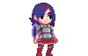

<!-- Improved compatibility of back to top link: See: https://github.com/othneildrew/Best-README-Template/pull/73 -->

<!-- PROJECT SHIELDS -->
[![MIT License][license-shield]][license-url]

<!-- PROJECT LOGO -->
 

  

<h3 align="center">Solara: Journey of the Sun Shards</h3>

  

	The very early stages of a 2D platformer game I'm making in Godot. I mostly have no idea what I'm doing but it's fun.
  

<!-- ABOUT THE PROJECT -->
## About The Project

[![Product Name Screen Shot][product-screenshot]](https://example.com)

### Game Summary
*Solara: Journey of the Sun Shards* is an exhilarating 2D platformer that blends hack-and-slash action with roguelike elements. Players control Solara, a courageous female knight from an ancient order, who embarks on a journey to restore light to a world plunged into eternal twilight.

### Story
In a world cast into darkness by the shattering of a powerful amulet linked to the sun, Solara must retrieve the scattered fragments to bring back the light. Starting from deep within treacherous caves, she ascends through diverse biomes—mines, jungle ravines, surface plains, mountainous terrains, high peaks, and finally the ethereal clouds—to fulfill her destiny.

### Gameplay Features
<ul>
	<li>Dynamic Combat: Utilize a variety of attacks including light and heavy strikes, spinning aerial attacks, and combos. Master blocking, bashing, and parrying to overcome enemies.</li>
	<li>Acrobatic Maneuvers: Experience fluid movement with abilities like double-jumping, air dashing, ledge grabbing, wall-sliding, and wall-jumping.</li>
	<li>Procedurally Generated Levels: Enjoy endless replayability with procedurally arranged levels, each ascent presenting new challenges.</li>
	<li>Roguelike Progression: Unlock new abilities and upgrades as you collect amulet fragments, enhancing Solara’s agility and combat prowess.</li>
</ul>

### Inspirations
Drawing inspiration from classics like Dead Cells, Castlevania, and Neon Abyss, Solara's Ascent combines tight gameplay mechanics with an emotionally engaging narrative.

### Journey with Solara
Join Solara on her epic quest from the depths of the earth to the heights of the heavens. Confront ancient secrets, face mythical beings, and discover the true power of her lineage as you strive to restore the sun and bring hope to a darkened world.

(<a href="#readme-top">back to top</a>)

### Built With

* [![Godot][GodotEngine.org]][Godot-url]

(<a href="#readme-top">back to top</a>)

<!-- LICENSE -->
## License

Distributed under the MIT License. See `LICENSE.txt` for more information.

(<a href="#readme-top">back to top</a>)

<!-- MARKDOWN LINKS & IMAGES -->
<!-- https://www.markdownguide.org/basic-syntax/#reference-style-links -->
[license-shield]: https://img.shields.io/github/license/casht0wn/Solara.svg?style=for-the-badge
[license-url]: https://github.com/casht0wn/Solara/blob/master/LICENSE.txt
[GodotEngine.org]: https://img.shields.io/badge/Godot-478CBF?style=for-the-badge&logo=godot&logoColor=white
[Godot-url]: https://godotengine.org 
[product-screenshot]: assets/images/screenshot.png
